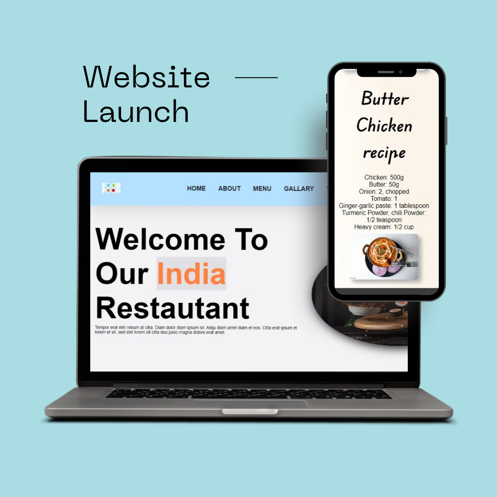

# icp-8.0-html-css-javascript-group-project-3
## The Sassy Spoon - Pune Website (README)
**Project Name:** The Sassy Spoon - Pune Website

**About the Hotel:**

The Sassy Spoon is a boutique hotel in Pune that offers a unique and stylish experience for travelers. The hotel features comfortable accommodations, delicious on-site dining, and a variety of amenities to make your stay enjoyable.

**Website Features:**

* **Homepage:**  
    * A captivating hero image showcasing the hotel's ambiance.  
    * A clear and concise value proposition highlighting The Sassy Spoon's unique offerings.  
    * Easy access to booking options and special offers.  
* **Rooms & Suites:** 
    * Detailed descriptions of each room type with high-quality photos. 
    * Information on amenities included in each room.  
    * Virtual tours (optional, but highly recommended).  
* **Dining:** 
    * Information on the hotel's restaurant(s) and bar(s), including menus and operating hours. 
    * Option to make reservations online.  
* **Amenities:** 
    * A comprehensive list of all the hotel's amenities, such as a spa, fitness center, pool, etc. (if applicable). 
    * High-quality photos showcasing these amenities.  
* **Things to Do:** 
    * Recommendations for nearby attractions and activities for guests to explore.  
    * Links to relevant websites or booking platforms. 
* **About Us:** 
    * The hotel's story, mission, and philosophy. 
    * Information on the management team.  
* **Gallery:** 
    * A collection of high-resolution photos showcasing the hotel's facilities, rooms, and surroundings.  
* **Contact Us:** 
    * Easy-to-find contact information, including phone number, email address, and physical address. 
    * A contact form for inquiries.  
* **Booking Engine:** 
    * A secure and user-friendly booking engine for guests to reserve their stay online.  
    * Integration with popular payment gateways.  

**Technical Specifications:**

  *HTML,CSS,JS 

**Deployment:**
    <a href="https://ind-restro.netlify.app/">

**Contribution:**
<a href="https://github.com/KrushnaX0X0/icp-8.0-html-css-javascript-group-project-3.git">
  [!hey](./img/read-me/ss.png)
</a>

